# MOS Amplifier and Frequency Response Analysis - README

本專案為 MOS 放大器與頻率響應分析之作業與模擬整理，由 Chao-Yang Zhan 撰寫，基於 0.5 μm CMOS 製程（SPICE Level-1 模型）進行完整的電路設計、直流偏壓、頻率響應、動態範圍及寄生效應分析。內容結合文字說明與模擬圖表，提供直觀且嚴謹的效能評估。

---

## 📋 系統設計規格 (Design Specifications)
* **供應電壓 (VDD)**：3 V
* **訊號源內阻 (Rsig)**：3 kΩ
* **負載電阻 (RL)**：10 kΩ
* **耦合與旁路電容 (CCI, CCO, CS)**：5 μF
* **設計目標**：電壓增益大小 |vo/vsig| ≥ 30 且總功率消耗 < 1 mW

---

## 1. 偏壓電流與 W/L 比例設計
* **製程參數**：μn = 460 cm2/V·s，tox = 9.5 nm，Cox ≈ 3.63 × 10-3 F/m2，kn' ≈ 167 μA/V2。
* **工作點與功率**：設定 ID = 100 μA，分壓網路電流 1.5 μA，總電流 201.5 μA，總功率消耗 P = 0.6045 mW（符合 < 1 mW 標準）。
* **元件尺寸與偏壓**：晶體 M1 尺寸 W1 = 134.5 μm (L1 = 0.5 μm)；源極隨耦器 M2 尺寸 W2 = 15 μm (L2 = 0.5 μm)。設定 RD = 10 kΩ、RS = 10 kΩ 以滿足 VDS1 = 1 V。

| 電路原理圖與配置 | DC 工作點模擬結果 |
| :---: | :---: |
| 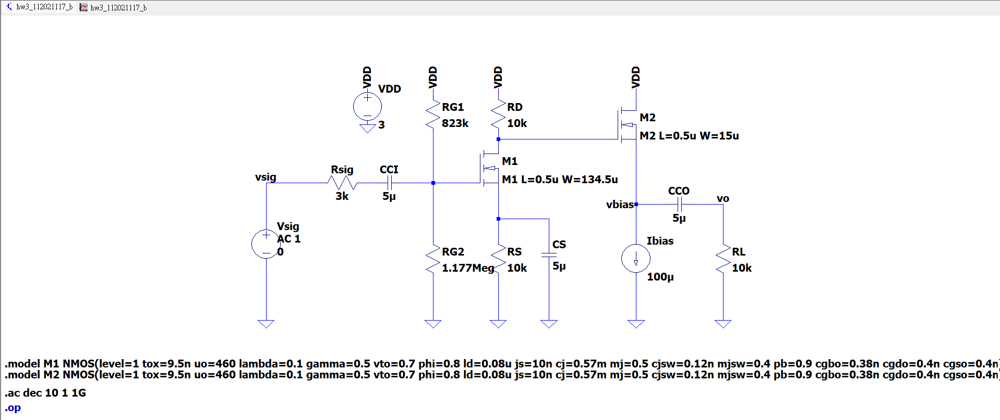 *圖 1：MOS 放大器完整電路原理圖* | 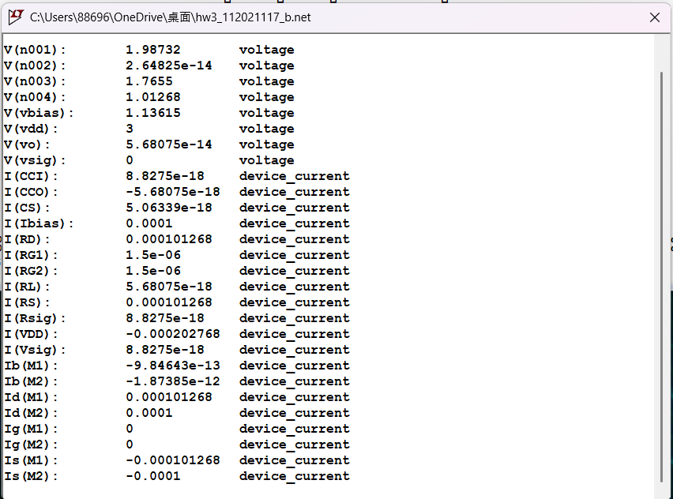 *圖 2：DC Operating Point 節點電壓與電流* |

---

## 2. 頻率響應分析
* **中頻增益**：AC 掃描（1 Hz 至 1 GHz）顯示中頻增益約為 30.17 dB，符合 ≥ 30 之設計規範。
* **頻寬與功耗**：低頻截止頻率 fL ≈ 115.5 Hz，高頻截止頻率 fH ≈ 23.27 MHz。實際總功率消耗 Pactual ≈ 0.6083 mW。

| 增益頻率響應曲線 | 相位頻率響應與 3-dB 標註 |
| :---: | :---: |
| 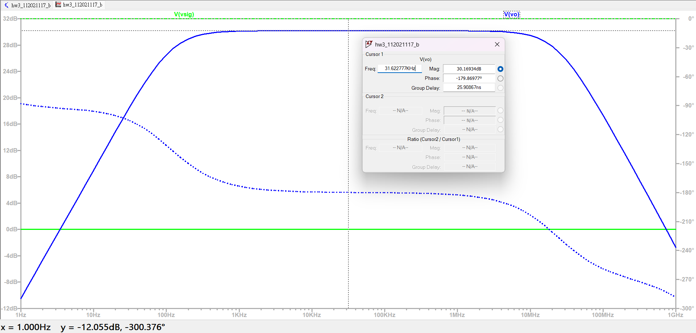 *圖 3：AC 掃描之電壓增益對數頻率圖* | 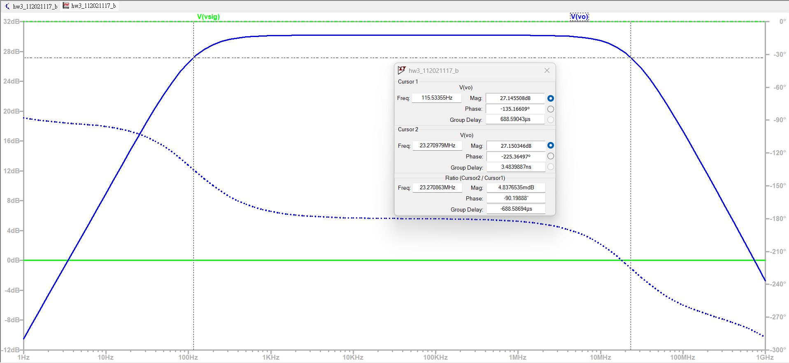 *圖 4：頻率響應之相位變化與截止點* |

---

## 3. 動態範圍分析
* **輸出振幅限制**：理論最大輸出振幅 v̂o,max ≈ 0.947 V，暫態模擬負向擺幅極限約為 -0.871 V。
* **誤差成因**：差異主因係體效應（Body Effect）推升閾值電壓 Vth 及 M2 大訊號非線性。最大輸入信號振幅 v̂sig,max ≈ 27.01 mV。

| 暫態響應輸出波形 | 非線性剪波 (Clipping) 狀態 |
| :---: | :---: |
| 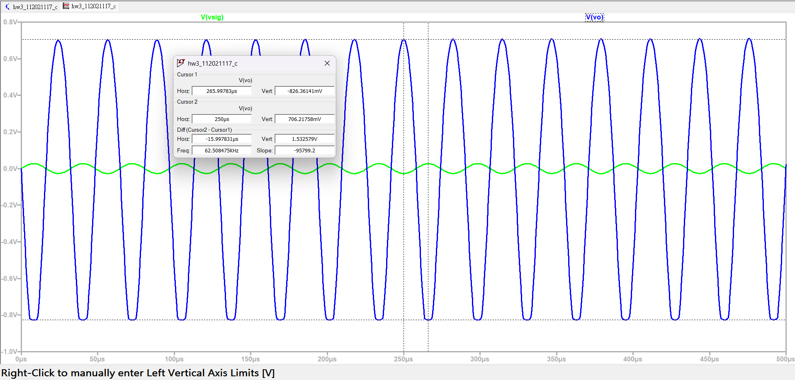 *圖 5：正常輸入下之輸出暫態響應* | 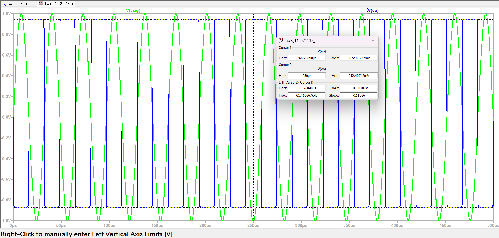 *圖 6：達到最大擺幅限制時的非線性截波* |

---

## 4. 移除晶體 M2 之影響
* **電路簡化**：移除源極隨耦器 M2 後轉為標準共源極放大器。
* **增益與頻寬變化**：中頻增益降至 ≈ 25.21 dB，高頻截止頻率顯著擴展至 ≈ 40.88 MHz，主因是輸出端寄生電容減少。

| 移除 M2 後之電路架構 | 有無 M2 之 AC 頻寬比較 |
| :---: | :---: |
| 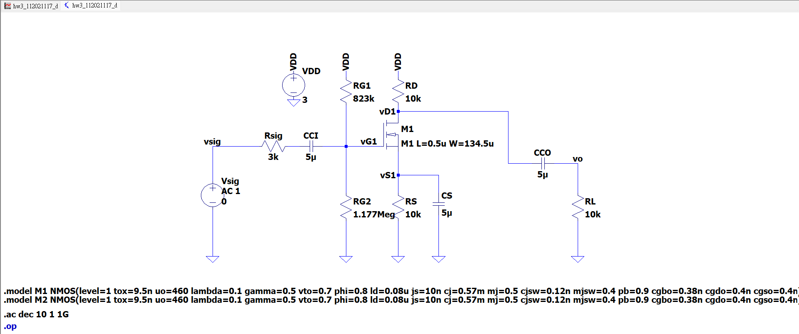 *圖 7：標準共源極放大器電路圖* | 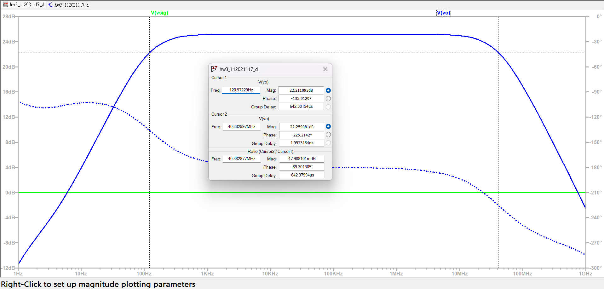 *圖 8：頻寬擴展與增益差異對比曲線* |

---

## 5. 移除 CS（無源極旁路電容）之影響
* **增益崩潰**：移除 CS 引入強烈負回授，中頻增益劇降至 ≈ -1.0 dB。
* **頻寬位移**：低頻截止頻率降至 < 1 Hz，高頻截止頻率大幅擴展至 ≈ 398 MHz，展示經典的增益頻寬取捨（GBW Trade-off）。

| 無 CS 之放大器電路圖 | 增益崩潰與高頻擴展波形 |
| :---: | :---: |
| 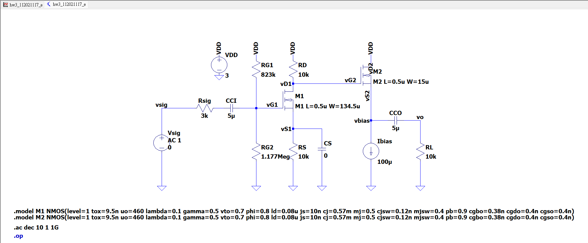 *圖 9：無源極旁路電容之電路架構* | 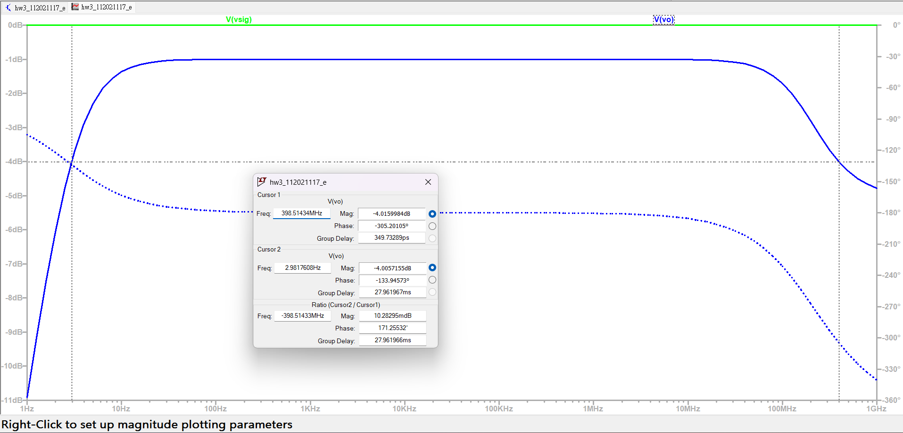 *圖 10：中頻衰減與極寬頻響應對比* |

---

## 6. 增加 Cgd 對頻寬惡化之影響
* **米勒效應**：外加 Cgd,add = 0.5 nF 雖不影響中頻增益（維持 30.17 dB），但使有效輸入電容激增至 16.44 nF。
* **高頻惡化**：高頻截止頻率 fH,f 嚴重惡化下降至 ≈ 2.84 kHz，證實米勒倍增效應對高頻頻寬的宰制影響。

| 外加 Cgd 之測試電路圖 | 高頻截止頻率嚴重衰減對比 |
| :---: | :---: |
| 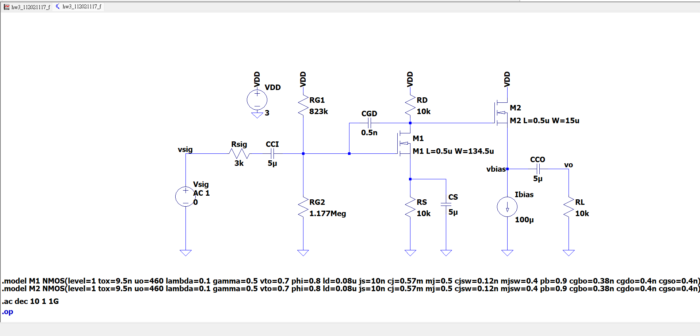 *圖 11：加入回授電容 Cgd 之架構* | 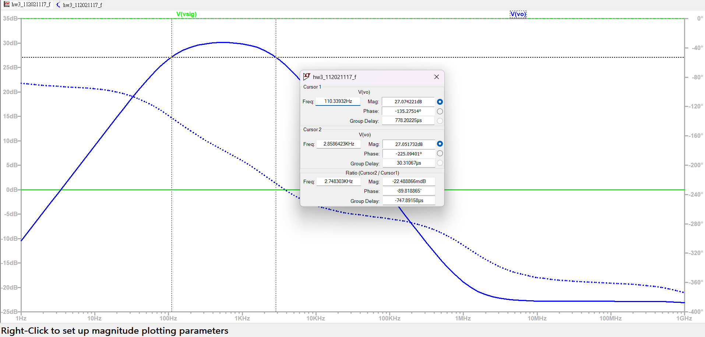 *圖 12：米勒效應導致高頻提早滾降之響應* |